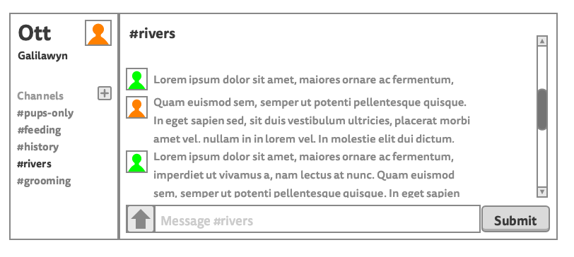

# React: Components, props, and children

## Learning goals

1. Describe the purpose of the virtual DOM
1. Compare the virtual DOM to the actual DOM
1. Contrast imperative and declarative programming
1. Identify components from a wireframe and draw out the flow of information
1. Describe the component hierarchy using the terms root, parent, and child
1. Create a React app that renders "Hello, World!" to the screen
1. Define the term prop in the context of React
1. List the types of data that can be passed as props
1. Explain the benefits or drawbacks of using the tool `create-react-app`
1. Create a React app that renders a container, one list, and five list items

## What was hard about vanilla JS?

* Knowing how to structure the application code; one file? multiple?
* It's hard to tell what's happening at any point, how things should be structured?
* Having to use `.innerHTML` and `.appendChild`, the code got really long and confusing; trying to tell your application how to interact with the HTML
* Get's repetitive pretty quickly

## Objectives

- Take the wireframe from our design team and
  - ~~Identify components~~
  - ~~Map out the initial component hierarchy~~
- Create a new React app using `npm init react-app ott`
  - ~~Remove all boilerplate code~~
  - ~~In [`app`](./ott/src/App.js) component, render "Hello, World!"~~
  - ~~Import dummy data from [`data.js`](./ott/src/data.js)~~
  - Create a static app from the wireframe (almost finished)

## Components

- App
  - Sidebar
    - Profile
    - ChannelsDisplay (ChannelsList)
  - Chat
    - ChannelContent (MessagesList)
      - UserMessage (Message)
    - SubmitForm (UserInput?)

## Prop flow

## Questions/notes

* Imperative: what to do, how to do it, when to do it
* Declarative: more direct, "this is how I want you to look, you figure it out"
