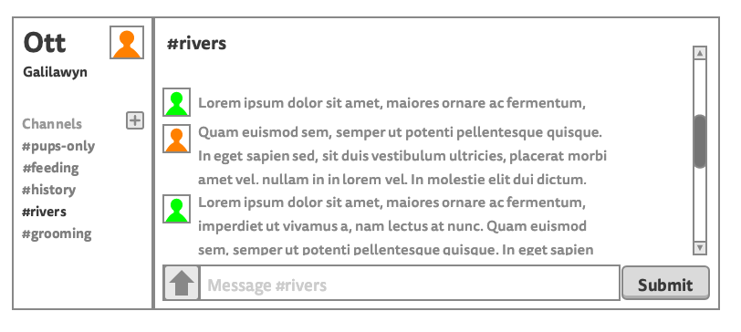

# React: Components, props, and children

## Learning goals

1. Define state in the context of React components
1. Contrast the concepts of props and state
1. Describe the two ways to initialize state in a React component
1. Explain how updating state affects the component
1. List out the function signature (the arguments we pass to) `setState`
1. Identify where `setState` can be called in a React component
1. Explain the differences in writing event handlers in React versus the DOM
1. Describe the difference between event objects in React versus the DOM
1. Explain how to get information from inputs in a React form on submit

## Objectives

- ~~Take the wireframe from our design team and~~
  - ~~Identify components~~
  - ~~Map out the initial component hierarchy~~
- ~~Create a new React app using `npm init react-app ott`~~
  - ~~Remove all boilerplate code~~
  - ~~In [`app`](./ott/src/App.js) component, render "Hello, World!"~~
  - ~~Import dummy data from [`data.js`](./ott/src/data.js)~~
  - ~~Create a static app from the wireframe (almost finished)~~
- ~~Identify the minimal state our application needs~~
- Identify which components should control that state
  - What are the events that we expect to happen in our app?
  - What needs to happen in response to those events? (Usually updating state)
    - What's different about events in React?
    - What does the event object look like?
  - Add state to those components
    - Two ways to set initial state

### Components

Step 1 of Thinking in React: [Break The UI Into A Component Hierarchy](https://reactjs.org/docs/thinking-in-react.html#step-1-break-the-ui-into-a-component-hierarchy)

Given a wireframe, we want to be able to break down pieces of the design into components that we can write out in code. As we learn more, we'll understand better what makes a component. For now, a component is a grouping of HTML elements or other components. Common components are containers (like App), lists (like ChannelContent or ChannelsDisplay), and then smaller groupings (like Profile).

#### Product

- App
  - Sidebar
    - Profile
    - ChannelsDisplay or ChannelsList
  - Chat
    - ChannelContent or MessagesList
      - UserMessage or Message
    - SubmitForm or UserInput?

### Prop flow

Step 2 of Thinking in React: [Build a static version in React](https://reactjs.org/docs/thinking-in-react.html#step-2-build-a-static-version-in-react)

Part of completing this step also means deciding where props are passed down. We started this work last lecture, but we can also map it out.

#### Product

Parentheses `()` are props.

- App
  - Sidebar **(currentUser, channelNames)**
    - Profile **(currentUser)**
    - ChannelsDisplay **(channelNames)**
  - Chat **(currentUser, channel)**
    - ChannelContent **(channelName, messages)**
      - UserMessage **(profilePhoto, text)**
    - SubmitForm **(currentUser)**

### Should it be state?

Step 3 of Thinking in React: [Identify minimal UI state](https://reactjs.org/docs/thinking-in-react.html#step-3-identify-the-minimal-but-complete-representation-of-ui-state)

List out all the data your application needs, then ask these questions about each piece of data. Whatever you have left is your state:

    1. Is it passed in from a parent via props? If so, it probably isn’t state.
    2. Does it remain unchanged over time? If so, it probably isn’t state.
    3. Can you compute it based on any other state or props in your component? If so, it isn’t state.

Another helpful way to think about state is that it is data that will change over time. Straight from the React docs:

      Figure out the absolute minimal representation of the state your application needs and compute everything else you need on-demand. For example, if you’re building a TODO list, keep an array of the TODO items around; don’t keep a separate state variable for the count. Instead, when you want to render the TODO count, take the length of the TODO items array.

#### Product

All `channels` and user input `text` should be state!

### Aside: What are our user stories?

User stories are helpful when trying to decide where state should live, or which components should define/own that state. A well-written user story for writing React apps looks like this:

* When a user <does something>
  * in <some component>
  * then <something happens/renders>
  * in <some (other?) component>

Our user stories for our Slack clone are below:

* When a user clicks the up arrow
  * in the `SubmitForm` component
  * then they can upload a file
* When a user clicks the plus symbol
  * in the `ChannelsDisplay` component
  * then a new channel name is rendered
  * in the `ChannelsDisplay` component
* When a user sends a message
  * in the `SubmitForm` component
  * then the new message appears
  * in the `Chat` component
* When a user clicks on a channel name
  * in the `ChannelsDisplay` component
  * then the channel's messages are rendered
  * in the `Chat` component
* When a user types into the input box
  * in the `SubmitForm` component
  * then the message text appears
  * in the `SubmitForm` component

### Which component owns state (where does state live)?

Step 4 of Thinking in React: [Identify Where Your State Should Live](https://reactjs.org/docs/thinking-in-react.html#step-4-identify-where-your-state-should-live)

For our example today, we'll stick to the form component and look a bit at events. Events and state go together!

*Making this decision means figuring out from the user stories, what is the nearest common parent/ancestor component between where the event happens and the components that need to re-render based on the event.*

#### Product

Parentheses `()` are props.
Squigglies/curlies `{}` are state.

- App
  - Sidebar (currentUser, channelNames)
    - Profile
    - ChannelsDisplay **{channelNames}**
  - Chat (currentUser, channel)
    - ChannelContent (channelName, messages)
      - UserMessage (profilePhoto, text)
    - SubmitForm (currentUser) **{text}**
